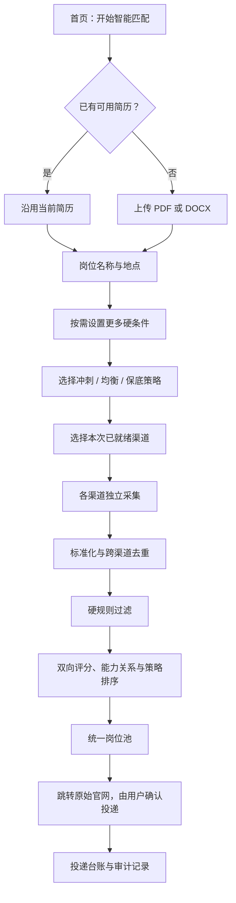

# 维护手册

这份文档回答三个问题：改一项产品行为应该去哪里、改完要验证什么、怎样避免把渠道特例继续堆进主流程。

## 用户主流程



再次使用时，简历上传不是必填项；没有选择新文件就沿用 `candidate.resume_path` 指向的本地副本。选择新文件后，服务端只保留一个 `current.pdf` 或 `current.docx`，并把可提取文本写入 `current.txt`。新文件、文本和配置更新失败时会恢复旧版本。

## 代码地图

| 目标 | 主要文件 | 维护边界 |
|---|---|---|
| 修改配置字段及校验 | `src/job_agent/config.py` | 新字段必须有默认值，保证旧 `config.json` 可读取 |
| 修改岗位/候选人数据 | `src/job_agent/models.py` | 同步检查 SQLite 行转换与前端字段 |
| 修改硬规则、能力分类、评分 | `src/job_agent/matching.py` | 硬规则与软排序保持分层；补充 `tests/test_matching.py` |
| 修改简历解析、上传与替换 | `src/job_agent/resume.py`、`service.py`、`web.py`、`static/app.js` | 只接受 PDF/DOCX、10 MB；解析先于替换；补 `tests/test_service.py` |
| 新增或维护渠道 | `src/job_agent/connectors/campus.py`、`official.py`、`registry.py`、`config.example.json` | 内置校园协议集中在 `campus.py`；普通新渠道无需改编排器，专用多阶段写流程才增加明确执行器 |
| 修改采集编排 | `src/job_agent/orchestrator.py` | 负责通用调度、持久化和健康状态，不解析具体站点 |
| 修改本地 API | `src/job_agent/web.py` | 保持 JSON 错误结构 `{error, message}` |
| 修改页面流程 | `src/job_agent/static/` | 无构建步骤；同时验证键盘、桌面和移动宽度 |
| 修改数据表和台账 | `src/job_agent/database.py` | 迁移必须向前兼容已有本地数据库 |
| 修改便携包启动 | `src/job_agent/launcher.py`、`scripts/build_portable.ps1` | 用户数据固定写入程序旁的 `data/` |

## 分层关系

```text
浏览器页面
  ↓ JSON API
AgentService（配置、简历、本地查询）
  ↓
JobAgent（通用编排） ── ChannelRegistry（渠道注册）
  ↓                         ↓
matching.py             具体 Connector
  ↓                         ↓
              Database / SQLite
```

- `web.py` 不应包含业务判断，只负责路由、请求解析和错误码。
- `service.py` 负责跨配置和文件系统的协调操作；简历替换使用临时文件与失败回滚，但文件系统和 `config.json` 不是数据库式单事务，异常退出后的恢复逻辑必须保留测试。
- `orchestrator.py` 的发现、校验、评估和清单生成只认 `ChannelAdapter`。内置 BOSS 与官网保留不同执行协议；普通新渠道通过可选 `submit()` 接口接入，不能继续按新渠道 ID 堆分支。
- Connector 只产出标准 `Job`；空壳页面、搜索入口和无法验证的摘要不能作为岗位。
- `matching.py` 先返回硬规则原因，再做能力关系和排序。策略配额不能改变硬规则结论。

## 本地数据

便携包默认结构：

```text
JobAgent/
├─ JobAgent.exe
├─ docs/
└─ data/
   ├─ config.json
   ├─ job-agent.sqlite3
   └─ resumes/
      ├─ current.pdf 或 current.docx
      └─ current.txt
```

源代码运行时，默认数据位置由命令行参数决定。不要把 `data/`、真实简历、Cookie、Token、邮箱密码或 SQLite 文件提交到 Git。

## 配置兼容原则

1. 新增 dataclass 字段时提供安全默认值。
2. `config_from_dict` 必须能读取旧配置；删除或重命名字段需要显式迁移。
3. 保存配置前调用 `validate()`；配置文件采用同目录临时文件替换，避免半写入。
4. API 密钥只能通过环境变量或未来的本地密钥存储提供，不写入示例配置。
5. 页面常用字段和高级 JSON 最终都写回同一个 `config.json`，不能维护两套真相。

## 修改后的最低验证

```powershell
$env:PYTHONPATH='src'
.\.venv\Scripts\python.exe -m unittest discover -s tests -v
.\.venv\Scripts\python.exe -m compileall -q src tests
```

前端改动还需：

1. 启动 `job-agent serve`。
2. 在桌面宽度完成“沿用简历”和“替换简历”两条路径。
3. 在约 390 px 宽度检查向导、表单、表格和导航是否可操作。
4. 只用键盘完成打开向导、下一步、选择策略和取消。
5. 模拟无渠道、渠道未就绪、单渠道失败、空结果和 API 错误。

真实网站测试与离线单元测试分开。没有最新页面证据时，不得宣称某个招聘渠道可用。

五个内置校园官网的只读现场冒烟命令：

```powershell
$env:PYTHONPATH='src'
.\.venv\Scripts\python.exe .\scripts\smoke_campus_channels.py --keyword "产品经理"
```

维护者应核对每个渠道返回数量大于 0、示例标题符合关键词、详情 URL 可区分到具体岗位。滴滴 Moka 还要覆盖 Cookie 会话和 AES-CBC 解密；腾讯要确认搜索结果可取得完整详情。站点改变接口时，只把对应渠道标记为失败，不要用列表壳、搜索摘要或旧 fixture 伪装成功。

## Windows 便携包

```powershell
.\scripts\build_portable.ps1
```

脚本会拒绝非 64 位 x86 Python，把中间产物放入 `work/portable/`，最终 ZIP 放入 `outputs/JobAgent-windows-x64.zip`。GitHub tag `v*` 会触发 `.github/workflows/windows-portable.yml`，先跑离线测试再上传 Actions artifact；是否附加到 GitHub Release 由维护者另行执行，当前工作流不会自动创建 Release。

基础便携包包含本地页面、SQLite、规则匹配、简历解析、通用 JSON API 和五个 `campus_api` 校园官网适配器（含滴滴响应解密依赖），不包含 Playwright 或 Chromium。因此 BOSS 和 `strategy: browser` 的官网在基础 ZIP 中会明确提示缺少浏览器依赖；需要这些实验能力时从源码安装 `.[browser]`。ZIP 必须解压到当前用户可写目录，否则程序无法在同级创建 `data/`。

发布前至少验证：首次启动生成 `data/config.json`、自动打开浏览器、第二次启动保留配置和简历、端口被占用时能选择后续端口。

自动化冒烟测试可设置 `JOB_AGENT_NO_BROWSER=1`，避免启动器弹出默认浏览器；普通用户启动时不要设置该变量。

## 当前明确不做

- 绕过验证码、自动登录或接管用户账号。
- 从搜索入口或 SPA 加载壳推断岗位。
- 对不确定的真实写操作自动重试。
- 把演示数据、规则评分称为大模型判断。
- 把基础便携包描述成已经包含 Playwright、登录态或浏览器扩展。
- 把 `autofill.status: planned` 描述成浏览器插件已经实现。
- 在默认用户流程中替用户点击最终官网提交；源码中的实验性写执行器必须显式确认且默认关闭。
